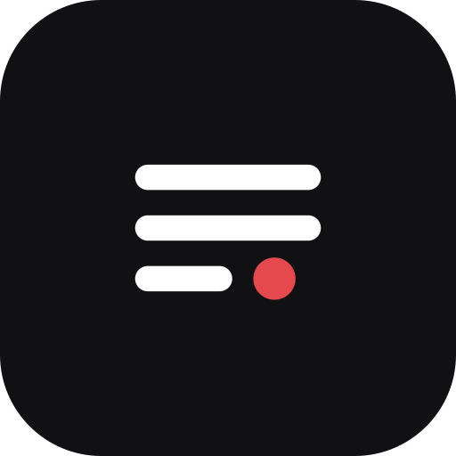
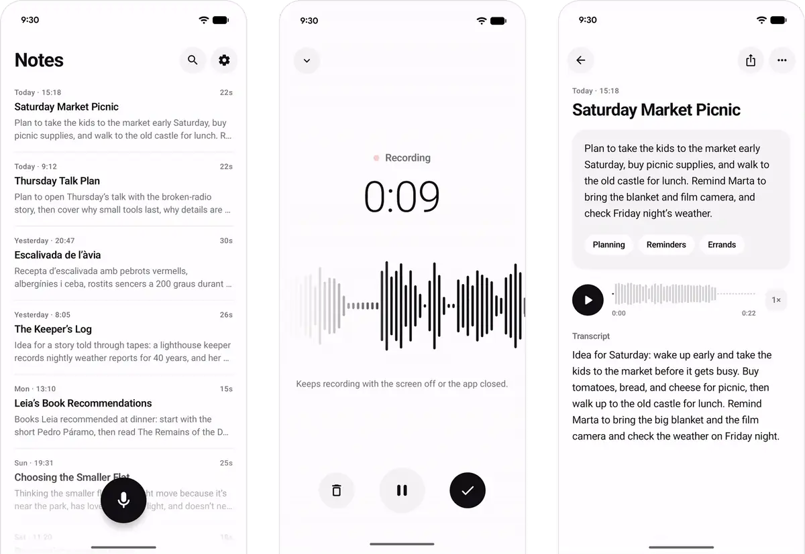
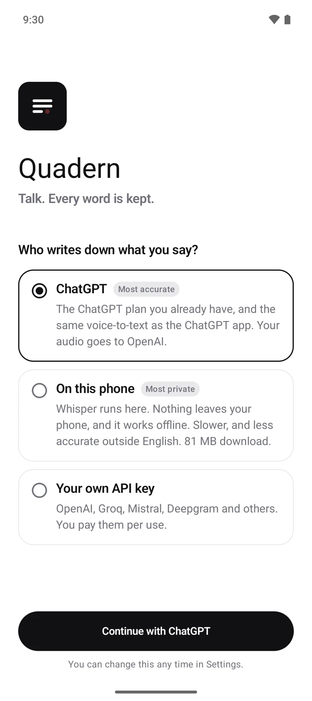
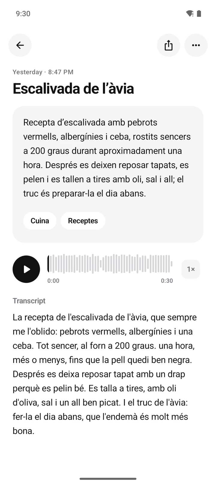
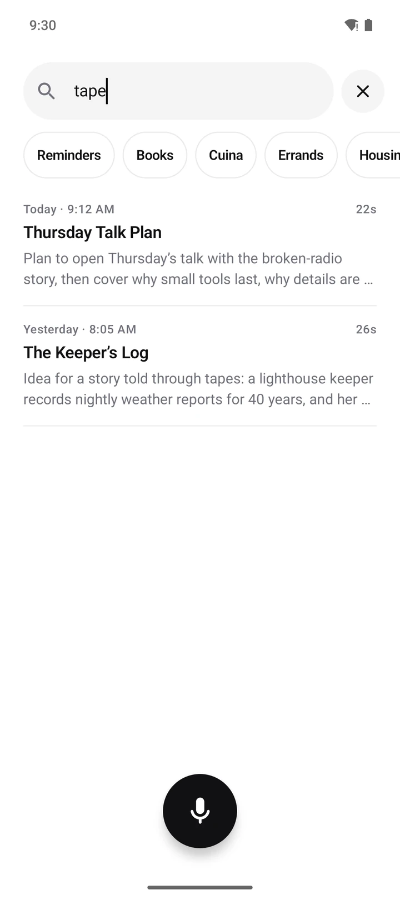
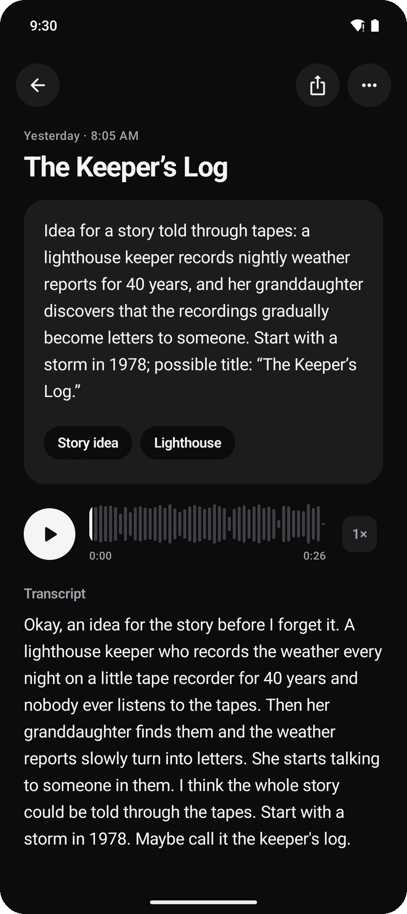

<div align="center">



# Quadern

### Think out loud.

*Quadern* is Catalan for notebook: the small one you carry everywhere.

A voice-notes app for Android. Tap once and talk; you get an exact transcript, a short title,
a summary in plain words and a few tags. Transcribe with the ChatGPT plan you already have,
or keep everything on your phone with Whisper, offline.

[](https://github.com/aleixrodriala/quadern/releases)
[](#download)
[](LICENSE)

**[Download](#download) · [Who listens](#who-listens) · [Nothing gets lost](#nothing-gets-lost) · [Principles](#principles) · [Privacy](#privacy) · [FAQ](#faq)**

<br>



</div>

> [!IMPORTANT]
> **Quadern is in beta.** It's used every day, but it's new. If something breaks or feels
> wrong, [open an issue](https://github.com/aleixrodriala/quadern/issues).

## What it does

<table>
<tr>
<td width="50%" valign="top">

#### The most accurate, or the most private
Transcribe with your ChatGPT account, the same speech-to-text as the ChatGPT app. Or run
Whisper on the phone itself: offline, and your voice never leaves it. You choose on the first
screen.

</td>
<td width="50%" valign="top">

#### Every word is kept
Recording goes on with the screen off, the app closed or the phone in a pocket. If Android
closes the app, the phone restarts or the battery dies, what you said is saved as a normal
note. [How](#nothing-gets-lost).

</td>
</tr>
<tr>
<td valign="top">

#### A title, a summary, a few tags
Each note gets a short title, a summary in plain prose and one to three tags, in the language
you spoke. Rename anything; your title is never overwritten.

</td>
<td valign="top">

#### Long notes, no waiting
A long recording is cut at natural pauses and transcribed while you are still talking. Stop
after twenty minutes and most of it is already text.

</td>
</tr>
<tr>
<td valign="top">

#### Calm, with the details done
Black and white, one button, no clutter. A waveform that follows your voice, a small haptic
tick when you start, and a quiet shimmer while the summary is written.

</td>
<td valign="top">

#### Nothing in the middle
No Quadern account, no servers, no analytics. Notes stay on your phone. Audio goes only
where you chose.

</td>
</tr>
</table>

<p align="center">




</p>

## Who listens

| | ChatGPT | On this phone | Your own API key |
|:--|:--|:--|:--|
| | **Most accurate** | **Most private** | |
| Cost | Included in your ChatGPT plan | Free | Pay per use |
| Accuracy | Very high, many languages | Good in English, weaker elsewhere; bigger models help | Depends on the service |
| Your audio goes to | OpenAI | Nowhere | That service |
| Internet | Needed | Not needed (after a one-time model download) | Needed |

**On this phone** uses [whisper.cpp](https://github.com/ggml-org/whisper.cpp) with a model
you pick, from Tiny (44 MB) to Large v3 Turbo (574 MB, for fast phones).

**Your own API key** works with OpenAI, Groq, Mistral (Voxtral), Deepgram, ElevenLabs, Google
Gemini, AssemblyAI, or any OpenAI-compatible server. You can also set a backup service for
when the main one fails.

### About the ChatGPT option

> [!NOTE]
> Quadern sends your audio to ChatGPT's own dictation service, signed in as you. OpenAI does
> not offer that service to other apps, so it could change or stop working at any time.
> OpenAI's terms don't allow reaching ChatGPT this way, and its
> [Sign in with ChatGPT](https://developers.openai.com/siwc/token-sharing-open-source/preview-limitations)
> program for other apps leaves transcription out, so in principle OpenAI could limit an
> account that uses it. Quadern says this plainly before you sign in. Quadern is not made by
> or affiliated with OpenAI.

1. Choose **ChatGPT** and tap **Continue**. OpenAI's own page opens in your browser.
2. Sign in there. Quadern never sees your password.
3. Come back. From now on, notes are transcribed with your account.

It uses the same sign-in as OpenAI's open-source [Codex CLI](https://github.com/openai/codex).
Tokens are stored encrypted on the phone with a key held in the Android Keystore, and are sent
only to OpenAI. Sign out in Settings.

If OpenAI ever asks, the project can pause the ChatGPT route for every install through a small
[status file](https://aleixrodriala.github.io/quadern/status.json); the app then says so and
your notes wait, or go to your backup service. Your recordings are never affected: switch to
another way and press "Transcribe again".

ChatGPT's dictation silently drops audio after about 10.7 minutes of a single upload, so
Quadern never sends more than 8 minutes at once: pieces are 4 to 6 minutes long, cut at the
quietest moment.

## Nothing gets lost

A voice note is often something you can't say twice, so most of the care in Quadern goes into
keeping it.

- **Saved as you speak.** Audio goes to disk while you talk, in a format that stays playable
  even if it's cut off mid-word, and is flushed to storage every three seconds.
- **Ready for the worst moment.** If Android closes the app, the phone restarts or the battery
  dies, you keep everything up to the last few seconds, as a normal note. Since Android 14 no
  app may start the microphone at boot, so after a restart you press record again.
- **Patient with the network.** No signal? Notes wait and transcribe when it's back. Each
  piece retries on its own, so one bad connection never costs the whole note.
- **Never locked in.** Your audio stays on your phone. If a service stops working, choose
  another and transcribe again.

We test each of these on real phones by closing the app, restarting the phone and pulling the
power in the middle of a sentence.

## Principles

- **Every word is kept.** Losing a recording is the one thing a voice-notes app must never do.
- **One job.** Record, transcribe, find. No chats, folders, templates, streaks or meeting bots.
- **Plain words.** Summaries are short prose in the language you spoke, not bullet points.
- **Quiet.** No badges, no tips, no notifications you didn't ask for.
- **Yours.** Notes live on your phone. You choose who hears your audio.
- **Honest.** When something is unofficial, slow or limited, the app and this page say so.

What Quadern won't do: ask you to create an account, show ads, track you, sell a subscription,
or send your notes anywhere you didn't choose.

## Download

<a href="https://github.com/aleixrodriala/quadern/releases"></a>
<a href="https://apps.obtainium.imranr.dev/redirect?r=obtainium://add/https://github.com/aleixrodriala/quadern"></a>

- **Android 10 or newer**, arm64 (almost every phone from the last six years).
- **Updates:** add the repository to [Obtainium](https://obtainium.imranr.dev) (turn on
  "Include prereleases" while Quadern is in beta), or install a newer APK over the old one.
- **Verify what you install.** APKs are built by GitHub Actions from the tagged source and
  signed with the same key. Check a download with
  `gh attestation verify Quadern_<version>.apk -R aleixrodriala/quadern`.
- **Not on Google Play** for now. See the [FAQ](#faq).

## Privacy

Recordings, transcripts and summaries stay on your phone. Quadern talks to:

- the transcription service you chose, which receives the audio (none, if you chose
  "On this phone");
- the service that writes summaries, which receives the transcript text and the names of your
  most used tags (you can turn summaries off);
- `huggingface.co`, only to download an on-device Whisper model;
- `aleixrodriala.github.io`, about twice a day and only while ChatGPT is chosen, for the
  status file above;
- nothing else. No analytics, no crash reports, no servers of mine.

Full details in [PRIVACY.md](PRIVACY.md).

## FAQ

<details>
<summary><b>Does it cost anything?</b></summary>

No. Quadern is free and open source. With the ChatGPT option, transcription counts as ChatGPT
use on your plan, like dictation in the ChatGPT app.
</details>

<details>
<summary><b>Can I use it without ChatGPT?</b></summary>

Yes. Choose "On this phone" and Whisper transcribes on the phone itself, offline. Or bring your
own API key.
</details>

<details>
<summary><b>Which ChatGPT plans work?</b></summary>

Tested with paid plans so far. If you use Free or Go, please tell us how it goes.
</details>

<details>
<summary><b>Could it get my ChatGPT account in trouble?</b></summary>

It could, in principle. OpenAI's terms don't allow reaching ChatGPT from other apps this way,
and OpenAI can limit accounts that break its terms. If that worries you, transcribe on the
phone or with an API key instead.
</details>

<details>
<summary><b>Is it affiliated with OpenAI?</b></summary>

No. ChatGPT is a trademark of OpenAI. Quadern is an independent project.
</details>

<details>
<summary><b>How is it different from Voicenotes, AudioPen or Google Recorder?</b></summary>

Those are good apps. Voicenotes and AudioPen need their own account and subscription (about
$100 to $200 a year). Recorder works only on Pixels, in fewer languages. Quadern has no account
and no subscription, runs on any Android phone, and can keep everything on it.
</details>

<details>
<summary><b>Why isn't it on Google Play?</b></summary>

Play's rules don't allow apps that use a service in ways its terms don't cover, and the ChatGPT
option is unofficial. Rather than ship a weaker app there, Quadern is on GitHub for now.
</details>

<details>
<summary><b>Was this made with AI?</b></summary>

Much of the code was written with AI coding assistants (Claude and Codex). I decide what to
build, review the code and test every release on real phones.
</details>

## Building

JDK 17+, the Android SDK with platform 37 and NDK `29.0.14206865` (for on-device Whisper).

```bash
./gradlew :app:assembleDebug        # app/build/outputs/apk/debug/app-debug.apk
./gradlew :app:testDebugUnitTest    # JVM tests
./gradlew :app:assembleRelease      # arm64; signed with keystore.properties if present
```

## Credits

[whisper.cpp](https://github.com/ggml-org/whisper.cpp) by Georgi Gerganov and contributors
(MIT) for on-device transcription; Android Jetpack, OkHttp and
[Concentus](https://github.com/lostromb/concentus) for Opus import. "Get it on GitHub" badge by
@flocke (CC BY-SA 3.0); Obtainium badge from the Obtainium project.

## License

MIT. ChatGPT is a trademark of OpenAI; Quadern is not affiliated with or endorsed by OpenAI.

<p align="center"><sub>Say it once. Keep it.</sub></p>
